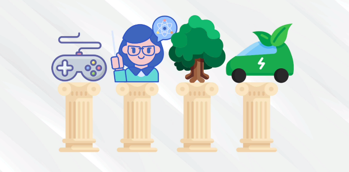

# The Four Pillars of Learning

**Develop a growth mindset**, which is the belief that intelligence can be developed,
opposite to a **fixed mindset**, which is the belief qualities are fixed traits and therefore cannot change. People with fixed mindset is making excuses to avoid challanges that could make them look dumb, and they'll give up as soon as they start struggling. 

With a growth mindset **everyting is a game**, and you improve constantly, exciting about every challange and obstacle standing in your way. Everything is trainable, and with enough effort and strategy, you can get better at anything. 

**The Feynman Technique**, is a technique named after **Richard Feynman**, a Nobel Prize Winning Physicist. It's designed to help you learn pretty much anything, understand concepts you don't really get, remember stuff you have already learnt, or study more efficiently.

1. Choose a concept you want to learn about
2. Pretend you are teaching it to a student in grade 6
3. Identify gaps in your explanation, go back to the source material, to better understand it
4. Review and simplify (optional)

**Trunk based knowledge**, is looking at knowledge as a tree structure and within that structure you start from the roots or the trunks of the tree in order to work your way to the leafs. For example, if you want to learn programming, you might want start with how computers work or why we use them. 

Make sure to understand the **fundemantal principals** before you go into details, because knowledge is constantly being updated but the fundametals could last throughout a career. So start with the basics and know your "why" before you dig deeper into a subject.

**Efficiency trumps grit** is about being smart with your time, about using the right strategies and methods to learn the right topics. It's not about putting in the extra hours, or work the hardest, because being busy, which seems like a good thing in modern society, just show lack of time management skills. 

