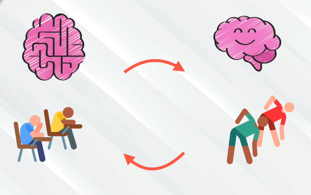

# The Science Behind Learning

We all have the tools to learn, even things that might not seem to come naturally to us. The secret to learn anything is to **understand how the brain works**, so you can unlock its power. When solving a problem, it can be done using **focused thinking** or **diffuse thinking**. When your brain is in **focus mode**, you really concentrate on the matter at hand, it’s like having a one-track mind. Focused thinking is a **highly attentive state of mind** where the brain uses its best concentration abilities in the prefrontal cortex, to ignore all extraneous information.

When your brain is in **diffuse mode**, you let it wander freely, making connections at random. The diffuse mode of thinking does not happen in one area of the brain, but rather all over the place. In fact, that is the beauty of diffuse thinking, your brain has the opportunity to **connect the dots** and **link neural processes**.

While these two modes may seem to work in opposition to each other, **alternating between them** is the best way to **master a subject** or to solve a difficult problem. First, use the focused mode to **understand the basics**, then use the diffuse mode to **passively internalize what you've learned** and make connections to other things you already knew. Go back into focused mode and pare down the best and most helpful connections. Once you've repeated this process a few times, the information will really stick.

Getting **plenty of deep, restful sleep** is essential for our physical and mental health, but a good night’s rest may also literally clear the mind. A [new study](https://directorsblog.nih.gov/2020/03/05/discovering-the-brains-nightly-rinse-cycle/) shows sleep triggers rhythmic waves of blood and cerebrospinal fluid (CSF) that appear to function much like a washing machine’s rinse cycle, which may help to clear the brain of toxic waste on a regular basis. **Sleep** is crucial when it comes to learing, because it's a state where the mind process and store information the brain has been fed during the day. 

**Brain training** includes getting information and repeat that information, since it helps transition a skill from the conscious to the subconscious mind. Physical exercise is also important as it reduce insulin resistance, reduce inflammation, and stimulate the release of growth factor chemicals in the brain, that affect the health of brain cells. It also improve the growth of new blood vessels in the brain, and even the abundance and survival of new brain cells. Thousands of new neurons are added into the adult hippocampus each day, and one of the most effective ways to keep these cells from dying, is by learning.

**Feedback** is an important part of learning, since it lets you know if you are on the right track or moving forward. A [recent study](https://hbr.org/2013/01/sometimes-negative-feedback-is) showed that experts or masters of their craft preferred negative feedback over positive. Probably because criticism is more actionable, it's easier when you know what you're doing wrong so you can focus on that. Positive feedback is great at the beginning when you might have self-doubt.

_"Early in the training process much of the feedback will come from the teacher or coach, who will monitor progress, point out problems, and offer ways to address those problems. With time and experience students must learn to monitor themselves, spot mistakes, and adjust accordingly. Such self-monitoring requires effective mental representations."_ - Anders Ericsson

**Procrastination** is actually about emotions, when you learn something new it activates an area of the brain associated with pain or negative feelings. To handle procrastination, there's no easy fix, you simly need to take the initiative and start doing the task. The pain you feel when you begin will actually make you feel better in the long term. People with anxiety, fear of failure or perfectionism are more likely to procrastinate, so by feeling happy and being in a good mode will help you overcome the procrastination.

Three things you can add to your daily anti-procrastination ritual:

1. **Just do it**! Despite all the doubt, all the fear, all the negativity, just do it. Publish that post. Message that person. Read that book. Start that course. Without thinking of the results of your effort.

2. **Start sloppy** to avoid high expectations of your finished work. More pressure often equals more procrastination. If you don't have to make the greatest thing ever right from the start, it's much easier to start.

3. **Start small**, because you probably don't feel like writing a whole final thesis on a topic you barely know or running a marathon. But you might feel like writing a paragraph or two or feel like taking a short walk outside. Take small steps along the longer journey.

**Long-term memory** is created when you practice and repeat over a period of time, which strengthen the connections between neurons. A connection between two neurons becomes stronger when `neuron A` consistently activates `neuron B`, making it fire an action potential (spike), and the connection gets weaker if `neuron A` consistently fails to make `neuron B` fire a spike. Long-term memory is extremly important when it comes to knowledge because that's where you put the **fundamental concepts and principles** used to pare new iformation with. 

**Short-term memory** usually involves our prefrontal cortex and can hold around **seven chunks of memory**, and moving information from short term memory to long term memeory is done by using something called **spaced repetition**. The problem with short-term memory is that the brain has **strict limits** on how many items it can hold in short-term memory at once. For some it is six items, for others it may be seven or eight, but the limit is generally about seven items. The limit can be pushed with training though.

Long-term memory doesn’t have the same limitations, in fact, no one has ever found the upper limits of long-term memory, but the downside is it takes much longer to deploy. Given enough time to work on it, you can memorize dozens or even hundreds of phone numbers. If nothinig is done with the new information within **1 hour**, most people have **forgotten about 50%** of what they learned, after 24 hours this increases to 70%, and if a week passes up to 90% could be lost.

Do small things **repeatedly over time** and connect them with different concepts that you already have in your brain. To memorize a famous person associate that person with a vacation, a friend or anything related to that person.

Listening to podcast or watching videos is **passive learning**, but in order to form connections between neurons you need to take action. **Active learning** is when you get involved, practicing, taking notes and solve problem. Retrieve knowledge from your long time memroy actually improve your ability to retrieve it in the future, so to be a better problem solver you must solve problems not look at answers.

By taking **small steps** and setting **milestones** you can avoid triggering the amygdalas fear detection system, and eliminate the fear of failure. Your goals should be small enough to be **manageable**, but specific and **well defined**, so you know what you want to hit. 

A goal without a plan is just a wish, a goal should follow the **S.M.A.R.T.** method:

- **S**pecific, your goal must be clear and well defined
- **M**easureable, set smaller milestone you can aim for
- **A**ttainable, make sure it's possible and achievable
- **R**elevant, "why" do you set this goal, is it relevant to your lifeplan
- **T**ime bound, you must have a deadline

Your plans need **evaluation and revision**, so constantly update your goals and set new ones in order to grow. The most effective types of practice follow the same set of general principles.

There are various sorts of practice that can be effective to one degree or another, but one particular form, called **deliberate practice** is the gold standard. It is the most effective and powerful form of practice that we know of, and applying the principles of deliberate practice is the best way to design practice methods in any area. 

## Deliberate Practice

When learning anything, you eventually reach a point where you start to plateau, and don't get that immediate progress you saw in the past. Beginners get frustrated at this stage as they don't see themselves improving. This is where **deliberate practice** comes in, which include setting **specific goals**, using **intense focus** and get **immediate feedback**. This requires getting out of your comfort zone, and it probably won't be much fun, since its hard work and you feel you are not good enough.

The best way to get past any barrier is to come at it from a different direction. A good choice is to work with a teacher or a coach, someone who is already familiar with the sorts of obstacles you’re likely to encounter, and can suggest ways to overcome them.

**Simplicity** is one of the hardest things in the world to do right. The Japanese kenshi (people who do kendo) are almost always way better than the Western kenshi. Why? It's because they spent years and years **working on basics**, whereas us Americans tend to be a bit more impatient. Eventually, this catches up to you and you and you can no longer catch up with everyone else.

The kendo **8th dan** test, has a less than 1% pass rate, and [this video]((https://www.tofugu.com/japan/kendo/) is really inspiring to watch. People who are trying to achieve this rank are trying again and again to pass the test. Why keep taking the test even though they keep failing? Because kendo is life, and failure is a part of that. If you're **passionate about what you do**, you'll never be able to make it perfect. You can either let that drive you insane, or you can let that drive you for your entire life.

**Spaced repetion** means going back and repeat what you've learnig over a long period of time, not going through everything or re-reading everything, just the important parts or concepts. You should have gaps of increasing length, because each time you do a recall at the sweet spot of forgetting, the memory’s decay slows down. 

Spaced repetition can be done using software like [Anki](https://apps.ankiweb.net/), which is a free and open-source flashcard program that utilizes spaced repetition, and has been shown to increase rate of memorization. This will fail if your cards feel bloated, disconnected or meaningless. It's not about collection, it's about connection, so make the cards **small**, **connected** and **meaningful**.

Science have proved **boredom** could actually be something positive, it increases our concern for the well-being of others and generate creative solutions. Boredom is both a warning that we're not doing what we want to be doing and a push, that motivates us to switch goals and projects.

When you have unique skills and abilities to solve problems, you become valuable to others.

My goals for 2020:

- **Learn Programming**: because I always wanted to but never had the confidence
  - **Learn Python**: because it can be used in so many ways and is pretty easy to learn
    - **Learn Linux**: to better understand scripting and programming
      - **Learn how computers work**: to better understand computer logic and problem solving
        - **Learn how to learn**: to actually be able to master computing
- **Learn Karate**: because I love the idea of combining body and mind
  - **Eat healthy**: to be able to train
  - **Work out**: especially leg muscles for the kicks
  - **Get the splits**: just a childhood dream, and it also is great for better kicks
    - **Stretch**: to be able to the splits