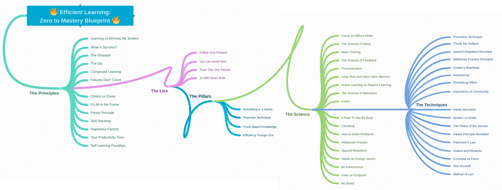

# The Techniques

There are lots of different techniques out there, but luckily you don't have to learn them all, instead find the technique that works best for you and stick with it. Use your understanding of how the brain learn new things, in order to take advantage of the learning system of your choice.



**The Pomodoro Technique** is about going back and forth between focus mode and diffuse mode, go into **focus mode** for 25 minutes, followed by 5 minutes of **diffuse thinking**. This technique is proven to be one of the best ways to tackle procrastination. The 25 minutes is just a suggestion, pick something that works with your schedule, could be 10 minutes of work followed by a 5 minute break.

From the terminal you can set up your own pomodoro session:

```code
sleep 1500 && notify-send "Your pomodoro session just ended"

sleep 300 && notify-send "Back to work"
```

When learning try to **chunk the subject**, which means breaking that subject down into small pieces that you can store in your long-term memory. Then use **spaced repetition** on that chunk, go back and repeat what you've learned, write it down in a notebook, or using an app like Anki, or create a diagram with the main concepts you learned. 

Just like spaced repetition, **deliberate practice** is tried and well-known and is something you have to do to be an efficient learner. Set **specific goals**, go into **focus mode** using the pomodoro technique and try getting **immediate feedback**. This is really hard work, but if it was easy, anyone would do it. Work hard and smart to really push yourself to your limit.

Beware of a rigid mind, keep your cup empty and never stop taking advice or feedback from others! The capacity and willingness to accept that there's more than one way to look at an issue is important. Acknowledge that differing perspectives are all legitimate. Is there something you haven't thought of, what is option C?

Create good **habits** using the four laws of behaviour change:

1. It has to be obvious, what is the exact thing you want to accomplish.
2. It has to be easy to form a new habit.
3. It has to be attractive, the outcome must lead to a better place.
4. It has to be satisfying, the new habit must be rewarding. 

You need to do it over and over for it to stick, so using a habit tracker app or similar is a good choice. Try **not to break the chain**!

When learning something, **evoke as many senses** as possible, since humans are incredibly good at remembering visual things. By using storytelling you will make it more memorable than just reading simple facts. The more your story evoke emotions and senses the better, and a great technique for creating such stories is the **method of loci** or the **memory palace technique**.

The idea behind **deep work** is to work hard and be efficient, in order to learn difficult skills and overcome the obstacles. That way you can become so good that society can't ignore you, and then passion doesn't matter, because it will follow. 

**Concepts** are high level topics that give you context of what you learn of the world around you.
**Concepts** are valuable, while **facts** are cheap, because anybody can learn facts, it doesn't require any special power to retain facts. The people that get paid well are respected in their careers, because they have these chunks of knowledge they can connect the dots with and they know the concepts, not only the facts. 

Never stop ask yourself why, use the **Feynman technique**, and you need to actually practice, you can't just passively watch somebody else do it. Test youself on what you just learned, even if its uncomfortable, but pause and think about what the key ideas were, and summarize. If you get something wrong, find out why, really understand what you did wrong in order to fix that problem, that way you learn from your mistakes.

Pick a topic and decide what you are going to do the **first 20 hours** to get as far as possible on your journey towards mastery!

1. Create a roadmap for the 20 hours.
2. Use active learning, create practice drills and test yourself every hour or so.
3. Create a good feedback system, so you know you hit your goals.
4. Start with the most critical skill, use the Pareto principle, the 20% that will give you 80%. 
5. Use the Pomodora technique and spaced repetition for the actual learning.
6. Avoid procrastination, make it easy and fun to continue.

A great video reminding you of [the science of thinking](https://www.youtube.com/watch?v=UBVV8pch1dM).